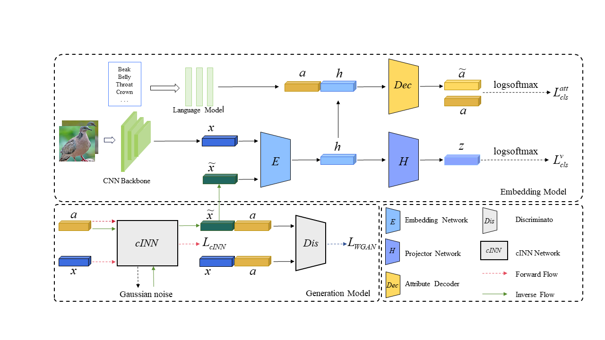

# DDCAZSL
Code for Dual-level Domain Confusion Alleviation for Generalized Zero-Shot Learning

## Abstract
Generalized zero-shot learning (GZSL) aims to recognize samples from seen and unseen classes using only labeled examples from seen classes. Recently, hybrid GZSL methods have integrated generative and embedding approaches, enhancing the performance of GZSL. However, current hybrid GZSL approaches suffer from two limitations: (1) the synthesized samples generated by existing generative models in hybrid methods for unseen classes are often of poor quality, which in turn leads to intra-domain confusion for unseen classes; (2) existing embedding models in hybrid methods lack effective constraints, thus failing to alleviate the domain confusion in the embedding space. To address these two issues, we develop a dual-level domain confusion alleviation (DDCA) framework for GZSL. Specifically, to alleviate intra-domain confusion for unseen classes, we integrate conditional invertible neural network (cINN) and a discriminator to form cINNGAN to generate visual samples with enhanced discriminative characteristics. Additionally, we further design an embedding network and alleviate domain confusion in the embedding space through visual and attribute constraints. We conducted extensive experiments on four widely used benchmark datasets, and the experimental results demonstrate that our method outperforms previous state-of-the-art methods

## Environments
- FrEIA 
```
git clone https://github.com/VLL-HD/FrEIA.git
cd FrEIA
git checkout 550257b10af7d8772b08d4aa9b18772e2c02
python setup.py install
```

## Data

You can download [datasets](https://drive.google.com/drive/folders/1IcQWpKk9ZBYlE1x4rRKsF9kdj5KXe6PA?usp=sharing) in data folder and run the scripts:
```
python train_FLO.py
```
